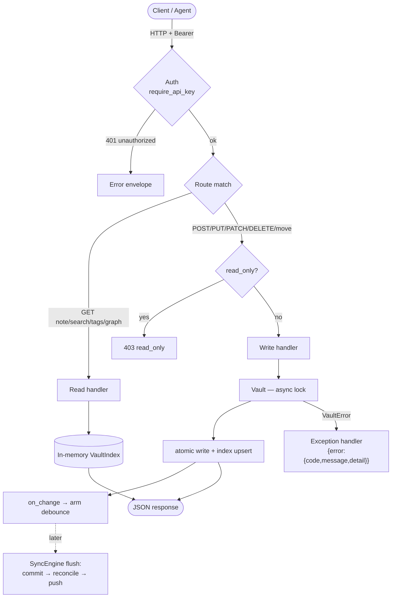

# Caldera — API Reference

Complete reference for Caldera's **REST API** and **MCP** surface. The REST API is
also self-documenting: a running server serves interactive Swagger UI at **`/docs`**
and the raw schema at **`/api/v1/openapi.json`**.

- Base path: **`/api/v1`**
- Content type: **`application/json`** (a single-note GET can also return `text/markdown`)
- Auth: **`Authorization: Bearer <key>`** on every `/api/v1/*` and `/mcp` route
- Spec: [`DESIGN.md`](DESIGN.md) (data model & semantics), [`SEARCH.md`](SEARCH.md), [`MCP.md`](MCP.md)

---

## 1. Request lifecycle



Writes return as soon as the file is on disk and the index is updated; the git
commit/push happens later, debounced (see [`DESIGN.md`](DESIGN.md) §5).

---

## 2. Authentication

All `/api/v1/*` and `/mcp` routes require `Authorization: Bearer <key>`, matched
(constant-time) against `CALDERA_API_KEYS`.

- Missing/invalid key → **`401 unauthorized`** with `WWW-Authenticate: Bearer`.
- If no keys are configured, the server **refuses to start** unless
  `CALDERA_ALLOW_NO_AUTH=true` (trusted-network opt-in), in which case the API is
  open. Health probes (`/healthz`, `/readyz`) are always unauthenticated.

---

## 3. Conventions

| Topic | Behavior |
|-------|----------|
| **Note paths** | Vault-relative, slashes allowed in the URL: `/api/v1/notes/Projects/Caldera.md`. Canonical form is NFC-normalized, `.md`-suffixed. Every response echoes the canonical `path`. |
| **`.md` optional on read** | `GET /notes/Projects/Caldera` resolves to `Projects/Caldera.md`. Writes should use the explicit `.md` path. |
| **ETag / concurrency** | Note GET/POST/PUT/PATCH return a strong **`ETag`** (the note's `sha256:…` checksum). Send `If-Match: "<etag>"` on a write → **`412`** on mismatch. The body `expected_checksum` field is an equivalent convenience → **`409 checksum_mismatch`** on mismatch. |
| **Errors** | Always `{ "error": { "code", "message", "detail" } }` — including framework 401/404/422. |
| **Pagination** | `?limit=&cursor=` on `/notes` (cursor is an integer offset). |
| **Representation** | `?format=markdown` on a single-note GET returns the raw note as `text/markdown`. |

### Error codes

| HTTP | `code` | Meaning |
|------|--------|---------|
| 400 | `invalid_path` | Empty path or path escaping the vault root |
| 401 | `unauthorized` | Missing or invalid Bearer key |
| 403 | `read_only` | Mutation attempted while `CALDERA_READ_ONLY=true` |
| 404 | `not_found` | No such note |
| 409 | `already_exists` | Create/move target already exists |
| 409 | `checksum_mismatch` | Body `expected_checksum` did not match |
| 409 | `collision_shadowed` | Target folds to the same canonical key as another on-disk file |
| 409 | `semantic_disabled` | `mode=semantic` but semantic search is off (and no fallback) |
| 409 | `hybrid_unavailable` | `mode=hybrid` (not implemented) |
| 412 | `precondition_failed` | `If-Match` header did not match |
| 413 | `note_too_large` | Body exceeds `CALDERA_MAX_NOTE_BYTES` |
| 422 | `validation_error` | Request validation failed (`detail` carries field errors) |

---

## 4. Notes

### `GET /api/v1/notes` — list notes
Lightweight stubs (no bodies).

| Query | Type | Default | Notes |
|-------|------|---------|-------|
| `folder` | string | — | Restrict to a folder prefix |
| `tag` | string | — | Only notes carrying the tag |
| `q` | string | — | Case-insensitive substring of the note name |
| `limit` | int 1–1000 | 100 | Page size |
| `cursor` | int ≥0 | 0 | Offset into the result |

**200** → `[{ "path", "name", "tags": [...] }]`

```bash
curl -H 'Authorization: Bearer KEY' \
  'http://host:8000/api/v1/notes?tag=project&limit=20'
```

### `GET /api/v1/notes/{path}` — get a note
Returns the full note with its graph context. Emits an `ETag` header.

| Query | Values | Notes |
|-------|--------|-------|
| `format` | `json` (default) \| `markdown` | `markdown` returns the raw file as `text/markdown` |

**200** (JSON):
```jsonc
{
  "path": "Projects/Caldera.md",
  "name": "Caldera",
  "content": "Body without frontmatter.",
  "raw": "---\n...\n---\nFull file including frontmatter.",
  "frontmatter": { "status": "active", "aliases": ["Project Caldera"] },
  "tags": ["project", "infra/server"],
  "links": [
    { "target": "Obsidian.md", "text": "Obsidian", "type": "wikilink", "resolved": true },
    { "target": null, "text": "Nonexistent", "type": "wikilink", "resolved": false }
  ],
  "backlinks": [ { "path": "Index.md", "text": "Caldera" } ],
  "stats": { "size_bytes": 1234, "modified": "2026-06-01T12:00:00Z" },
  "checksum": "sha256:…"
}
```
**Errors:** `404 not_found`.

### `GET /api/v1/notes/{path}/links` — outgoing links
**200** → `[{ "target", "text", "type", "resolved" }]`. `target` is the resolved
vault path, or `null` for an unresolved/ambiguous link.

### `GET /api/v1/notes/{path}/backlinks` — backlinks
**200** → `[{ "path", "text" }]` — notes that link **to** this one.

### `POST /api/v1/notes` — create a note
Body (`CreateNote`):
```jsonc
{ "path": "Notes/New.md", "content": "Hello", "frontmatter": { "status": "new" } }
```
`content` defaults to `""`, `frontmatter` is optional.

**201** → the full `Note` (+ `ETag` header).
**Errors:** `409 already_exists`, `409 collision_shadowed`, `413 note_too_large`,
`400 invalid_path`, `403 read_only`.

### `PUT /api/v1/notes/{path}` — replace / upsert
Body (`ReplaceNote`):
```jsonc
{ "content": "Updated body", "frontmatter": {...}, "expected_checksum": "sha256:…" }
```

| Query | Default | Notes |
|-------|---------|-------|
| `upsert` | `true` | If `false`, fails `404` when the note is absent |

Honors `If-Match` (→ `412`) or `expected_checksum` (→ `409`). **200** → `Note` (+ `ETag`).

### `PATCH /api/v1/notes/{path}` — partial update
Body (`PatchNote`) — any subset:
```jsonc
{
  "content_append": "\n## Appended",
  "frontmatter_merge": { "status": "done" },
  "frontmatter_delete": ["draft"],
  "expected_checksum": "sha256:…"
}
```
Appends to the body and/or merges/deletes frontmatter keys without rewriting the
note. **200** → `Note`. **Errors:** `404`, `412`/`409`, `413`.

### `DELETE /api/v1/notes/{path}` — delete
**204** No Content. **Errors:** `404 not_found`, `403 read_only`.

### `POST /api/v1/notes/{path}/move` — move / rename
The source is the URL path. Body (`MoveNote`):
```jsonc
{ "to": "Archive/Caldera.md", "update_links": true }
```
When `update_links` is true, `[[Caldera]]` wikilinks across the vault are rewritten
to the new basename (crash-safe via a journal, [`DESIGN.md`](DESIGN.md) §7.1).
**200** → the moved `Note`. **Errors:** `404`, `409 already_exists`, `409 collision_shadowed`.

---

## 5. Search & discovery

### `GET /api/v1/search` — search notes

| Query | Type | Default | Notes |
|-------|------|---------|-------|
| `q` | string | **required** | Query text |
| `mode` | `keyword`\|`semantic`\|`hybrid` | `keyword` | `keyword` is fuzzy (rapidfuzz) |
| `tag`, `folder` | string | — | Pre-filter the candidate set |
| `threshold` | float 0–100 | config | Drop weak matches |
| `limit` | int 1–500 | 50 | Max hits |

**200** → `[{ "path", "name", "snippet", "score", "match_type" }]`, ranked.
`match_type` ∈ `name`/`heading`/`body`/`tag`/`semantic`.

- `mode=semantic` requires semantic search enabled. If disabled: returns keyword
  results when `CALDERA_SEMANTIC_FALLBACK=true` (default), else `409 semantic_disabled`.
- `mode=hybrid` → `409 hybrid_unavailable` (not implemented).
- Scores are **not comparable across modes** (rapidfuzz 0–100 vs cosine 0–1).

### `GET /api/v1/search/status` — search backend state
**200** → `{ "keyword": "ready", "semantic_enabled": bool, "state": "disabled|ready|…", "model": str|null, "vectors": int }`

### `GET /api/v1/tags` — all tags
**200** → `[{ "tag", "count" }]` (alphabetical).

### `GET /api/v1/tags/{tag}` — notes with a tag
**200** → `[{ "path", "name", "tags" }]`.

### `GET /api/v1/graph` — whole-vault link graph
**200** → `{ "nodes": [{ "path", "name" }], "edges": [{ "source", "target" }] }`
(edges are resolved links only).

---

## 6. Vault & sync

### `GET /api/v1/vault` — vault status
**200** → `{ "source", "branch", "read_only", "dirty", "note_count", "tag_count" }`

### `GET /api/v1/vault/status` — sync status
**200** (`SyncStatus`):
```jsonc
{
  "last_pull": "…Z", "last_push": "…Z",
  "ahead": 0, "behind": 0,
  "committed_unpushed": 0,            // durability signal — alert if it climbs
  "last_error": null,
  "last_discard": { "recovery_ref": "refs/caldera/discarded/…", "recovery_ref_pushed": true, "commits": 1, "at": "…Z" },
  "last_auto_merge": null,            // set after a clean auto-merge (verify it)
  "next_poll": "…Z",
  "state": "idle"                     // idle|syncing|conflict|conflict_blocked|push_wedged|error
}
```

### `POST /api/v1/vault/sync` — trigger a sync
Body (`SyncRequest`): `{ "push": true }`. Runs an immediate commit→reconcile→push
cycle. **200** → `SyncStatus`.

### `POST /api/v1/vault/reindex` — rebuild the index
Forces a full re-parse of the working tree. **200** → `VaultStatus`.

---

## 7. Operational (no auth)

| Method | Path | Response |
|--------|------|----------|
| `GET` | `/healthz` | `{ "status": "ok" }` (liveness) |
| `GET` | `/readyz` | `{ "ready": true, "notes": N }` once cloned+indexed; else `503 { "ready": false, "error"? }` |
| `GET` | `/` | `{ "name", "version", "docs": "/docs" }` |
| `GET` | `/docs`, `/api/v1/openapi.json` | Swagger UI / OpenAPI schema |

---

## 8. MCP API (`/mcp`)

Streamable HTTP, same Bearer auth. Full design in [`MCP.md`](MCP.md). Tools share
the REST error codes (returned as the tool error message). Write tools are
**absent from `tools/list`** when `CALDERA_READ_ONLY=true`.

### Tools — read
| Tool | Args | Returns |
|------|------|---------|
| `get_note` | `path` | Full note (body, frontmatter, tags, links, backlinks, checksum) |
| `get_backlinks` | `path` | Backlinks list |
| `list_notes` | `folder?`, `tag?`, `name_contains?`, `limit?` | Note stubs |
| `search_notes` | `query`, `mode?`, `tag?`, `folder?`, `threshold?`, `limit?` | Ranked hits |
| `list_tags` | — | `{ tag: count }` |
| `vault_status` | — | `read_only`, `dirty`, `committed_unpushed`, `state`, counts |

### Tools — write (hidden in read-only)
| Tool | Args |
|------|------|
| `create_note` | `path`, `content?`, `frontmatter?` |
| `update_note` | `path`, `content`, `frontmatter?`, `expected_checksum?` |
| `patch_note` | `path`, `content_append?`, `frontmatter_merge?`, `frontmatter_delete?`, `expected_checksum?` |
| `move_note` | `path`, `to`, `update_links?` |
| `delete_note` | `path` |
| `sync_vault` | `push?` |

### Resources
| URI | Content |
|-----|---------|
| `caldera://note/{path}` | A note's raw Markdown |
| `caldera://vault/status` | Vault & sync status (JSON) |
