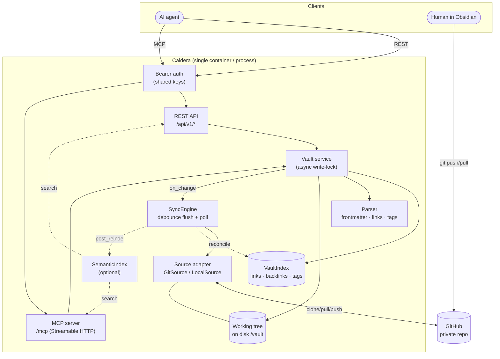
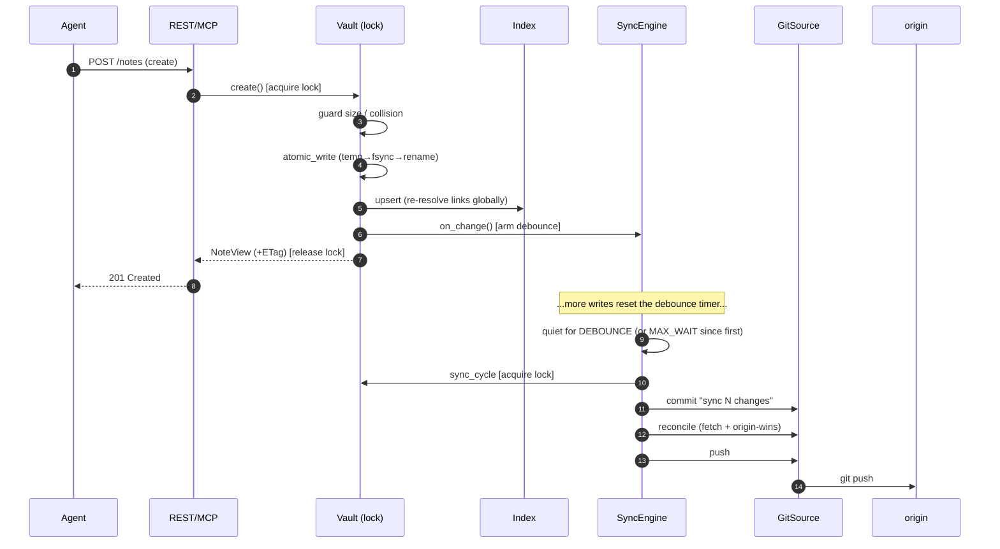
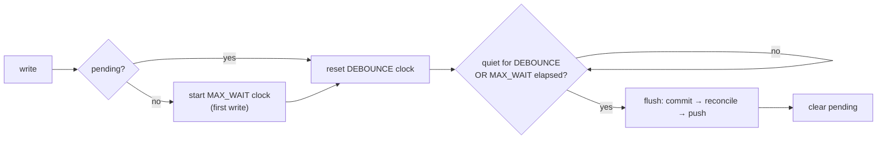
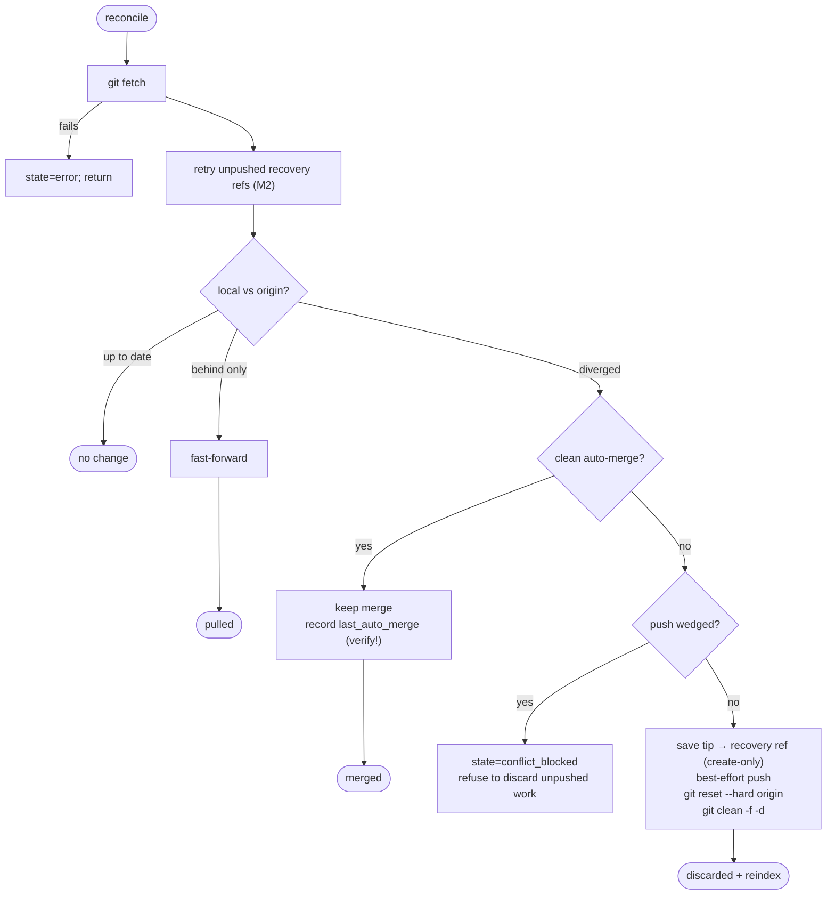
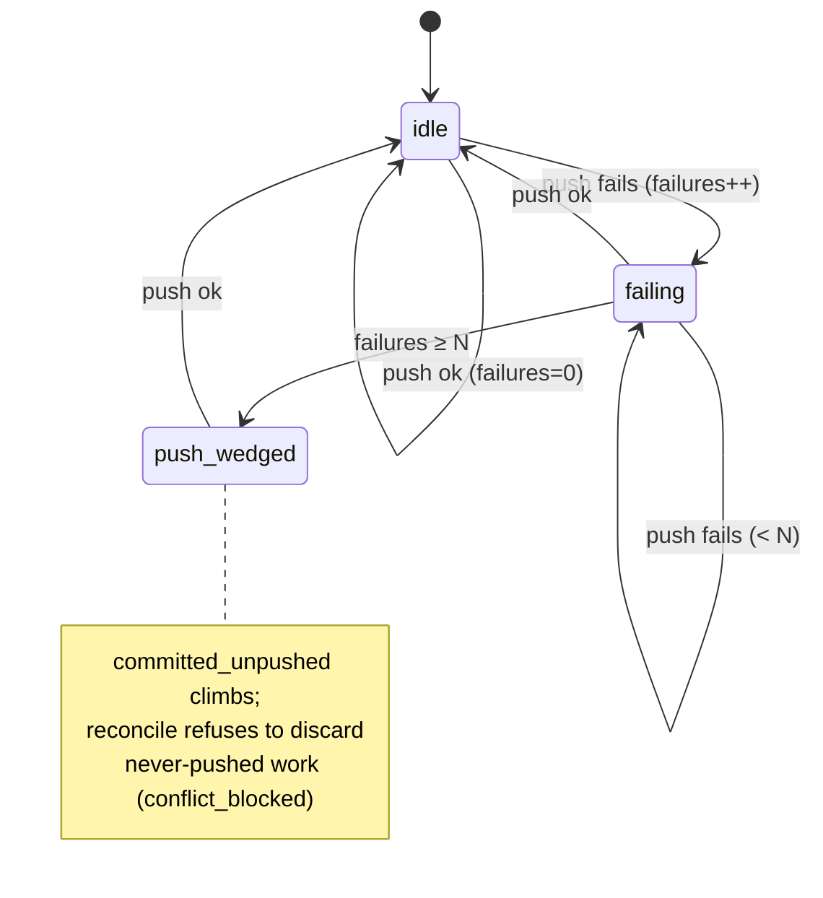
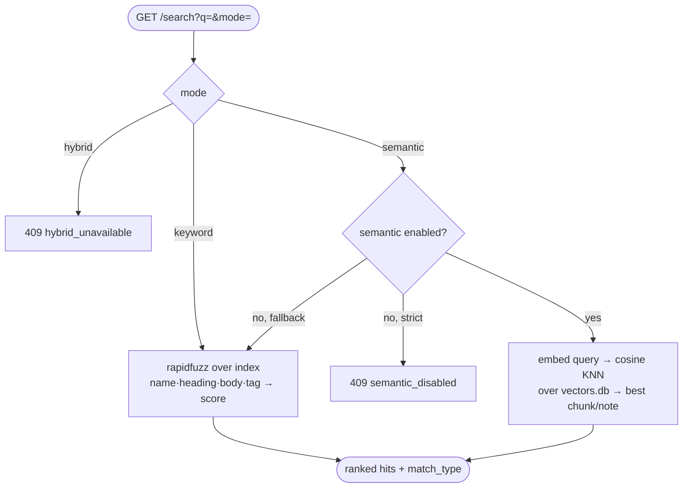
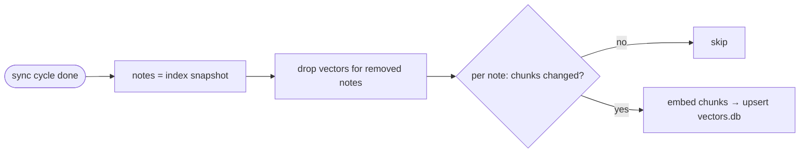
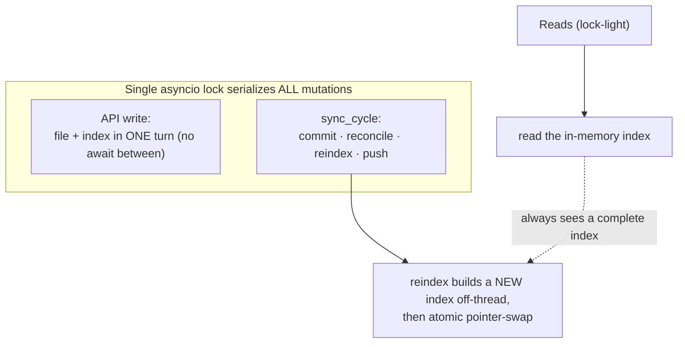

# Caldera — Architecture & Flow Diagrams

Visual companion to [`DESIGN.md`](DESIGN.md). Diagrams render on GitHub (Mermaid).
This document explains **how the pieces fit and how data flows**; the design doc
is the authoritative spec for semantics.

---

## 1. Components

One process, one vault. The REST API and the MCP server are two faces over a
single `Vault` service; everything else hangs off that.



| Component | File | Responsibility |
|-----------|------|----------------|
| REST API | `caldera/api/*` | HTTP routes, request/response models, OpenAPI |
| MCP server | `caldera/mcp_server.py` | Tools/resources over Streamable HTTP |
| Auth | `caldera/dependencies.py`, `main._BearerASGIMiddleware` | Bearer-key gate |
| Vault | `caldera/core/vault.py` | CRUD over the working tree; the only writer |
| Index | `caldera/core/index.py` | In-memory graph (links/backlinks/tags) |
| Parser | `caldera/core/parser.py` | Frontmatter + link/tag extraction |
| Semantic | `caldera/core/{embedding,vectorstore,semantic}.py` | Opt-in vector search |
| SyncEngine | `caldera/sync.py` | Debounced commit/push + periodic reconcile |
| Source | `caldera/sources/*` | Git clone/pull/push/reconcile |

---

## 2. Startup (bootstrap)

`/healthz` answers immediately; `/readyz` flips once the vault is cloned and
indexed. Embeddings (if enabled) warm in the background — readiness never waits
on them.

```mermaid
sequenceDiagram
    participant U as uvicorn
    participant L as lifespan
    participant Lk as WriterLock
    participant S as Source
    participant V as Vault
    participant Sy as SyncEngine

    U->>L: startup
    L->>L: check auth config (refuse if no keys & not opted in)
    L->>Lk: acquire() (git source, writable)
    Note over Lk: fresh lock held elsewhere → refuse to start
    L-->>U: app.state ready=false
    par background bootstrap
        L->>S: ensure_ready() (clone or open)
        L->>V: reindex() (full scan → atomic swap)
        L->>V: recover_journal() (finish interrupted move)
        L->>Sy: seed_paths(); start()
        L->>L: ready=true; background embed (if semantic)
    end
    U->>L: shutdown
    L->>Sy: stop() → final flush (drain)
    L->>Lk: release()
```

---

## 3. Write path & debounced flush

A write lands on disk + index immediately and returns; committing/pushing is
**debounced** so a burst becomes one commit.



### Flush timing (two independent timers, first wins)



- `CALDERA_COMMIT_DEBOUNCE` — reset by every write (flush a settled burst fast).
- `CALDERA_COMMIT_MAX_WAIT` — from the **first** pending write, never reset (bounds
  staleness under a continuous trickle).

---

## 4. Origin-wins reconcile

The remote is the source of truth. Local changes are best-effort but recoverable;
a push that can't reach origin blocks any destructive reset.



### Push-failure state machine



---

## 5. Search



Semantic embedding is incremental and hash-guarded, reconciled after each sync
cycle (outside the vault lock):



---

## 6. Concurrency & atomicity (why it's correct)



- **One writer:** every mutation (API writes, the flush, reconcile/reset/reindex)
  takes the same `asyncio.Lock`, so they never interleave.
- **Single-turn writes:** an API write does *file → index* with no `await`
  between, so it's all-or-nothing to any concurrent reader.
- **Atomic reindex:** a full rebuild constructs a fresh `VaultIndex` and swaps the
  reference, so readers never observe a half-built index.

See [`DESIGN.md`](DESIGN.md) §7 for the full treatment.
